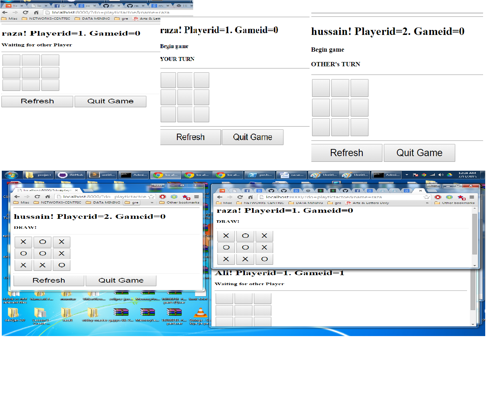

# NodeJS-TicTacToe-multigame

Project Description:
	NodeJS real-time app where different  users and play Tic tac toe game with each other.

Running the app:
	Open command prompt, go to project dir, then type:
		node toctactoe.js
	Now open different browsers and play the game

Future thought:
	I'm thinking of adding the support for playing against computer to this project. 
Some snapshots of the app working:

